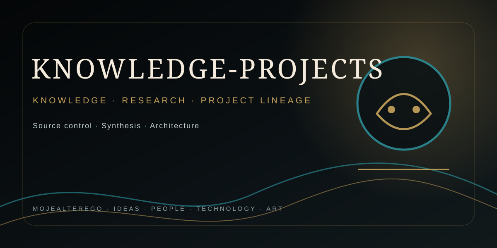

<div align="center">



## MOJEALTEREGO · PROJECT PROFILE

</div>

---

# Knowledge & Projects — Omni-Architect Repository

## [2026-09-09 / Iteration 11] — Compound reasoning, GEM, Apeiron/AURA lineage and voice-native AI game runtime

### Integrated source-derived knowledge

This iteration incorporated ten newly supplied PDFs covering:

- cache-aware Mega-Prompts, Self-Consistency, explicit context caching, asynchronous fan-out, rate limiting, early exit and semantic aggregation;
- GEM as a theoretical autonomous cognitive-executive ecosystem using H-MoE, specialist engines, OODA, long-term memory, causal prediction and constitutional/red-team control;
- Apeiron 1.0 cyber-gnostic decision artifacts using layered physical cards, thermal reveal, checksum and feedback loops;
- Black Apeiron 2.2 as an evolutionary black-box / cognitive-sovereignty physical artifact with thermal, UV and tactile information layers;
- AURA: The Collective as a sensory physical card-game architecture with thermochromic, scented, conductive and glow effects;
- Szept Wyroczni / Project Midas as a voice-first AI-character mobile game architecture with NLP, narrative interaction and Unity implementation.

### Deduplication and lineage

The two GEM concept PDFs were treated as one source lineage because their extracted text is identical. The two similarly named mobile monetization PDFs are near-identical versions of one Szept Wyroczni lineage; the third mobile-game PDF is an expanded/alternative version of that same lineage. Apeiron 1.0 and Black Apeiron 2.2 are evolutionary versions rather than duplicates. AURA, Apeiron and GEM map substantially into existing portfolio projects rather than creating duplicate numbered projects.

### Knowledge artifact created

- `docs/knowledge-base/compound-reasoning-gem-apeiron-aura-voice-game-2026-09-09.md`

### Existing-project evolution identified

- Project 27 — Compound Reasoning & Self-Consistency: explicit-cache lifecycle, asynchronous branch fan-out, rate-limit control, jitter/back-pressure, early exit and semantic/soft consistency.
- Project 17 — Adaptive Model Router: compound reasoning treated as an explicit execution profile with cache, cost, latency, privacy and verification dimensions.
- Project 24 — Agentic Prompt Compiler & DSL: structured reasoning protocols and result envelopes reinforce typed prompt-program compilation.
- Projects 61 / 68 / 72 / 79 — GEM reinforces orchestration, memory, OODA, causal prediction, constitutional control, red teaming and discovery-loop composition.
- Projects 01 / 05 / 50 / 51 / 52 / 53 / 57 / 71 — Apeiron and AURA reinforce physical/symbolic interfaces, sensory interaction, stochastic integrity, playtesting, multimodal rendering and manufacturing QA.

### New project genesis

**Project 81 — Voice-Narrative AI Game Engine MAX**

A new project was justified because the portfolio did not contain a dedicated runtime for voice-native AI-character games in which probabilistic voice/narrative behavior is strictly separated from authoritative game rules, RNG, economy, progression and consequential state.

The project is derived from the Szept Wyroczni / Project Midas lineage and integrates Projects 17, 24, 27, 50, 51, 52, 57, 61, 68, 71, 72, 73 and 76.

### Safety and epistemic controls

- Condorcet/self-consistency agreement is treated as a signal, not proof; correlated errors remain possible.
- Historical provider prices and performance estimates in the prompt-optimization report are not current repository facts.
- GEM remains a theoretical architecture; the corpus does not establish AGI.
- Apeiron symbolic interpretation is not treated as factual prediction.
- Covert persuasion, compulsive reinforcement and emotional monetization proposals from AURA/Szept sources are retained as cognitive-safety threat/design-analysis material, not production requirements.
- Voice-game purchases cannot covertly control AI affection or RNG odds.
- AI-generated intent/content cannot directly authorize consequential game-state changes.
- Voice processing is minimized/local-first where feasible and microphone state is explicit.

### Registry

`docs/PORTFOLIO-REGISTRY-2026-09-09.yaml` is now version 8 and includes Project 81. Project 81 remains `PROPOSED / ARCHITECTURE_BASELINE` until its MVP passes the voice → typed intent → authoritative command → state transition → postcondition verification loop under adversarial testing.

### Verification

Source reading, deduplication, full portfolio correlation, knowledge synthesis, Project 81 genesis, ingestion logging and registry update were completed. No force push was used.

---

## [2026-09-09 / Iteration 4] — Business/marketing strategy, sovereign digital economics, knowledge frontiers, defensive influence analysis and evidence methodology

### Integrated source-derived knowledge

This iteration incorporated the newly supplied corpus covering:

- business-model vs strategy distinctions, value creation/capture, resources, partners and organizational positioning;
- practical small-business marketing strategy, segmentation, targeting, BVP/USP, 7P, proto-personas, Customer Journey Maps, communication strategy and marketing planning;
- sovereign digital economy / “extreme monetization” concepts covering protocol fees, MEV/OEV, protocol-owned liquidity, AI-agent/DeFAI economics and RWA;
- broad unresolved-problem maps across fundamental physics, cosmology, mathematics, theoretical computer science, biology, consciousness, history and humanities;
- coercive-control, thought-reform and social-engineering material transformed into defensive detection and human-agency safeguards;
- historical DV-2023 immigration procedure preserved as year-bound reference material, not current guidance;
- sensitive case notes transformed into privacy-preserving evidence, chronology and claim-separation methodology.

### Knowledge artifacts created

- `docs/knowledge-base/marketing-strategy-small-business-and-customer-journey-2026-09-09.md`
- `docs/knowledge-base/sovereign-digital-economy-revenue-and-agentic-finance-2026-09-09.md`
- `docs/knowledge-base/frontiers-of-knowledge-unresolved-problems-2026-09-09.md`
- `docs/knowledge-base/defensive-coercive-control-and-social-engineering-analysis-2026-09-09.md`
- `docs/knowledge-base/historical-diversity-visa-dv2023-procedure-reference.md`
- `docs/knowledge-base/case-record-evidence-chronology-and-claim-separation-2026-09-09.md`

### Deduplication and project mapping

The two “Ekstremalna Monetyzacja” PDFs were treated as overlapping versions of one corpus rather than duplicated knowledge. The two unresolved-problem encyclopedias were likewise consolidated into one frontier map. Business-model/strategy material maps into the existing Project 66/67 adaptive strategy lineage rather than creating another duplicate project. The case material strengthens Project 32 without publishing its sensitive personal allegations.

### Epistemic and safety controls

- Historical DV-2023 rules are explicitly year-bound and are not current immigration advice.
- Sovereign-finance claims, market projections, yields and autonomous-agent performance remain source-derived/emerging rather than verified financial facts.
- Unresolved scientific questions remain open problems; proposed solutions are not promoted to established results.
- Coercive-control material is retained as defensive security knowledge, not an operational playbook for manipulating people.
- Sensitive case allegations remain unverified claims unless independently established by primary evidence.
- Evidence, inference, hypothesis and verified fact remain distinct.

### Architecture changes

- Marketing strategy is represented as an executable objective → hypothesis → channel → experiment → KPI → outcome loop.
- Business model and strategy remain separate but linked state objects.
- Digital-economy architectures distinguish protocol revenue, value extraction and asset yield with explicit risk/governance boundaries.
- Knowledge-frontier entries now support hypotheses, counterevidence, falsification tests and research status.
- Social-engineering analysis feeds agency/security controls rather than influence execution.
- Case records gain atomic chronology, contradiction matrices and claim-type separation.

### Verification posture

All six new knowledge artifacts were committed through GitHub contents operations. No new numbered project was created because the principal reusable capabilities map to existing business-strategy, scientific-verification, cognitive-security and Project 32 evidence lineages. No force push was used.

---

Reference repository for the project's **agent engineering knowledge base, architecture, research and engineered project portfolio**.

This repository is intentionally separated from the **Agents-for-Humans-Hackathon** submission repository. It is the long-lived research and systems-engineering layer; the hackathon repository contains only the CogniSync submission and its proof artifacts.

## Repository mission

The repository is operated as a continuous knowledge-to-engineering system:

```text
Knowledge → Model → Decision → Implementation → Verification → Evidence → Evolution
```

It is not a prompt collection. Projects are treated as engineered systems with explicit boundaries, contracts, security, verification, evaluation, observability and lifecycle state.

## Repository roles

### `docs/knowledge-base/`

Durable source-grounded and research-derived knowledge covering agent runtimes, MCP/MCP Apps, Skills, sandboxes, memory/state, orchestration, model routing, application builders, research/OSINT, multimodal systems, local/edge AI, cognitive security, systems engineering, data/ML/statistics/optimization, causal analytics, visualization, Bayesian/decision systems, professional artifact generation, Omnis/OmniCore, SemanticFS, CIRA, AI Foundry, PUI, business-model/strategy engineering, stochastic/game integrity and physical-symbolic manufacturing systems.

The knowledge base is documentation-first. Source claims remain distinguishable from engineering hypotheses, inferred conclusions and verified behavior.

### `projekty/`

Build-oriented project specifications derived from the knowledge base. The default engineering target is:

`problem → scope → architecture → contracts → security → verification → evaluation → roadmap`

The portfolio contains application systems, infrastructure, research laboratories, security fabrics, orchestration layers, data/evidence systems, creative systems and convergence architectures.

### `docs/REPOSITORY-AUDIT-2026-09-09.md`

Baseline audit recording the initial repository discovery, portfolio governance findings and the operationalization gap identified between architecture specifications and reusable verification/runtime infrastructure.

### `docs/PORTFOLIO-REGISTRY-2026-09-09.yaml`

Machine-readable portfolio snapshot using Project 47 lineage-first identity rules. It records observed project families, collisions, canonical artifacts and the current Project 72 candidate.

## Engineering doctrine

The portfolio follows these core invariants:

- model capability is not authorization;
- memory is not authorization;
- approval is not execution;
- MCP is a capability integration protocol, not an authorization authority;
- consequential actions require explicit policy and postcondition verification;
- authoritative state is separated from UI/widget state;
- unknown capability and ambiguous authority fail closed;
- evidence, inference, hypothesis and verified fact remain distinct;
- simulation is never silently promoted to real-world evidence;
- security analysis is stateful across trajectories and modalities;
- reduced monitorability increases external verification requirements;
- generated code and low-level artifacts remain untrusted until independently verified;
- human approval is modeled as a resumable, auditable state transition;
- stale state cannot silently overwrite newer state;
- project identity is resolved through lineage rather than filename alone;
- strategic/business-model assumptions remain distinct from observed outcomes;
- stochastic anomalies remain hypotheses until replicated and statistically characterized;
- physical manufacturing claims remain hypotheses until batch-tested;
- OSINT relationships require typed edges, provenance and entity-resolution evidence;
- negative findings are bounded observations, not proofs of nonexistence;
- speculative scientific frameworks remain explicitly separated from verified science.

## Portfolio architecture

```text
USER / OPERATOR
      ↓
CANONICAL PROJECT REGISTRY
      ↓
INTENT / PROBLEM / OBJECTIVE
      ↓
CONTEXT COMPILER
      ├── KNOWLEDGE / EVIDENCE GRAPH
      ├── REPOSITORY GRAPH
      ├── WORLD / DEVICE STATE
      ├── BUSINESS / STRATEGY MODEL
      └── SECURITY / HUMAN-AGENCY SIGNALS
      ↓
EPISTEMIC / REASONING CONTROL
      ↓
MODEL / SPECIALIST ROUTER
      ↓
VERIFIED PLAN / HYPOTHESIS / ARTIFACT SPEC
      ↓
CAPABILITY BROKER
      ↓
DETERMINISTIC EXECUTION / SANDBOX / SIMULATION
      ↓
AUTHORITATIVE READBACK
      ↓
POSTCONDITION / POLICY / SECURITY / AGENCY VERIFY
      ↓
ARTIFACT + STATE DELTA + EVIDENCE PACKET
      ↓
EVAL / AUDIT / RELEASE
      ↓
MEASURED OUTCOME
      ↺
```

## Canonical portfolio status

The repository contains project specifications through **Project 71**, plus **Project 72** as an operational-assurance architecture baseline. Historical duplicate numeric identifiers are intentionally preserved and reconciled through Project 47 rather than destructively deleted.

The observed collision groups include duplicated artifacts around Projects **60, 61 and 67**, in addition to earlier historical numbering collisions documented in Project 47. These are governance concerns and are not resolved by arbitrary renaming.

### Project families 37–59

The portfolio includes sovereign edge, scientific verification, Alibaba/cloud, agentic development, repository intelligence, Open Creator, Influence Literacy, AI Content, content/commerce, portfolio registry, grand-challenge intelligence, cognitive sovereignty, physical/phygital game systems, stochastic integrity, symbolic interfaces, epistemic control, multimodal intelligence, monitorability-aware oversight and autonomous execution/control.

### Project families 60–71

Later repository artifacts add systems engineering/intelligence, adversarial multimodal security, probabilistic learning/optimization, Omnis/learned-kernel/PUI convergence, data/causal/distributed intelligence, autonomous systems/agentic OS factory, adaptive business-model strategy, constitutional runtime, adversarial continuity/mobile defense, stochastic game integrity and physical artifact manufacturing/symbolic interfaces. Their canonical identity continues to be resolved by Project 47 lineage rules rather than filenames alone.

## New engineering evolution — Project 72

**Project 72 — OmniCore Cross-Framework Agent Assurance & Runtime Verification Fabric MAX**

Project 72 operationalizes control principles already distributed across Projects 47, 58 and 59 and integrates adjacent security/control capabilities from Projects 60, 68 and 69. Its target is a reusable assurance boundary for:

- framework-neutral event normalization;
- capability and authorization verification;
- state-transition invariants;
- authoritative postcondition verification;
- trajectory/security replay;
- evidence-linked audit records;
- monitorability measurement;
- production-vs-evaluation drift detection;
- cross-framework assurance adapters.

A dedicated implementation contract now exists at `projekty/72-omnicore-cross-framework-agent-assurance-and-runtime-verification-fabric-max/README.md`.

Its current status remains **PROPOSED → ARCHITECTURE BASELINE**. It is not production-ready until its Definition of Done is implemented and independently tested.

## Evidence classification

Every important repository claim must be classified as:

`OBSERVED → SOURCE_DERIVED → INFERRED → PROPOSED → VERIFIED`

No benchmark, provider capability, implementation status or performance result is promoted to VERIFIED without direct evidence.

## Continuous evolution protocol

Every new file, repository, paper, report, specification or other evidence entering the project is processed as:

```text
INPUT
 ↓
CLASSIFY
 ↓
DECOMPOSE
 ↓
NORMALIZE
 ↓
EXTRACT PRINCIPLES / ALGORITHMS
 ↓
MAP TO KNOWLEDGE GRAPH
 ↓
ASSESS EXISTING PROJECT IMPACT
 ↓
IDENTIFY IMPLEMENTATION OPPORTUNITIES
 ↓
CHECK FOR DUPLICATION
 ↓
EVALUATE NEW PROJECT GENESIS
 ↓
DEFINE VERIFICATION REQUIREMENTS
 ↓
UPDATE REPOSITORY
```

New projects are created only when the repository demonstrates a material capability gap or reusable value that is not better represented as an evolution of an existing project.

## Engineering lifecycle

```text
DISCOVER
 → INVENTORY
 → UNDERSTAND
 → MODEL
 → REASON
 → OPPORTUNITY DETECTION
 → PRIORITIZE
 → PLAN
 → IMPLEMENT
 → TEST
 → VERIFY
 → SECURITY AUDIT
 → INTEGRATION AUDIT
 → DOCUMENT
 → COMMIT
 → POST-COMMIT VERIFICATION
 → EVOLUTION ANALYSIS
```

For critical systems, counterexamples and failure modes are first-class engineering evidence.

## Current work state — 2026-09-09

### Knowledge Integrated

The repository contains broad knowledge spanning agent engineering, MCP, coding agents, multimodal systems, security, evidence/OSINT, data/ML/causal analytics, business-model strategy, stochastic integrity, physical artifacts and OmniCore convergence architectures. Iterations 3–4 additionally formalize OSINT influence graphs, investigative evidence methodology, TND/Codex Omega as an explicitly speculative research framework, cross-domain scientific verification, marketing strategy, sovereign digital economics, unresolved research frontiers, defensive social-engineering analysis and case-record evidence methodology.

### Projects Updated

- Project 32 gained influence/relationship graphing, chronology, negative-finding, source-hierarchy and entity-resolution controls.
- Existing adaptive business-model/strategy lineage is linked to the new marketing and business-model source material.
- Existing scientific verification and epistemic-control lineage is linked to the unresolved-problem frontier map and TND validation boundary.

### Knowledge Artifacts Created

- `docs/knowledge-base/osint-network-influence-and-investigative-evidence-2026-09-09.md`
- `docs/knowledge-base/tnd-speculative-mathematical-framework-and-validation-boundary.md`
- `docs/knowledge-base/cross-domain-scientific-verification-mhd-biophysics-optimization-2026-09-09.md`
- `docs/knowledge-base/marketing-strategy-small-business-and-customer-journey-2026-09-09.md`
- `docs/knowledge-base/sovereign-digital-economy-revenue-and-agentic-finance-2026-09-09.md`
- `docs/knowledge-base/frontiers-of-knowledge-unresolved-problems-2026-09-09.md`
- `docs/knowledge-base/defensive-coercive-control-and-social-engineering-analysis-2026-09-09.md`
- `docs/knowledge-base/historical-diversity-visa-dv2023-procedure-reference.md`
- `docs/knowledge-base/case-record-evidence-chronology-and-claim-separation-2026-09-09.md`

### Architecture Changes

- OSINT relationships now have typed temporal edges and independent provenance.
- Negative findings and narrative chronology are first-class evidence structures.
- Scientific claims are evaluated through governing models, invariants, failure modes and reproducible tests.
- TND contributes a reusable latent-state/observation abstraction while its stronger physical claims remain unverified.
- Marketing and business strategy are represented as separate but linked decision layers.
- Digital-economy mechanisms are separated into revenue, value-capture and asset-yield layers with governance boundaries.
- Research-frontier objects support hypothesis, evidence, counterevidence and falsification tracking.
- Social-engineering material is routed into defensive agency/security controls.
- Sensitive case narratives are transformed into privacy-preserving evidence structures.

### Security Changes

Active OSINT operations remain authorization-gated. Personal or reputational allegations from supplied reports are not promoted to verified facts. Network influence inference requires corroboration and explicit identity resolution. Sensitive case material is not reproduced into the public knowledge base. Historical immigration guidance is explicitly marked non-current.

### Verification

- Six new knowledge artifacts were committed through GitHub contents operations.
- Existing Project 32 evidence methodology remains the integration target for case-record patterns.
- Existing Project 66/67 business-strategy lineage absorbs the new marketing/business-model material.
- Duplicate source files were consolidated rather than duplicated in the knowledge base.
- No force push was used.

### Known Limitations

- The existing `projekty/README.md` index still requires a separate synchronized update for the newest Project 60–72 inventory.
- Project 72 remains non-production until its executable Definition of Done is implemented and independently tested.
- Historical project-number collisions remain governed by Project 47 and are intentionally not destructively renamed.
- The Deep OSINT code supplied in the corpus remains a collector baseline and requires production-grade provenance, authorization and verification layers.
- DV-2023 information is historical and cannot substitute for current immigration instructions.
